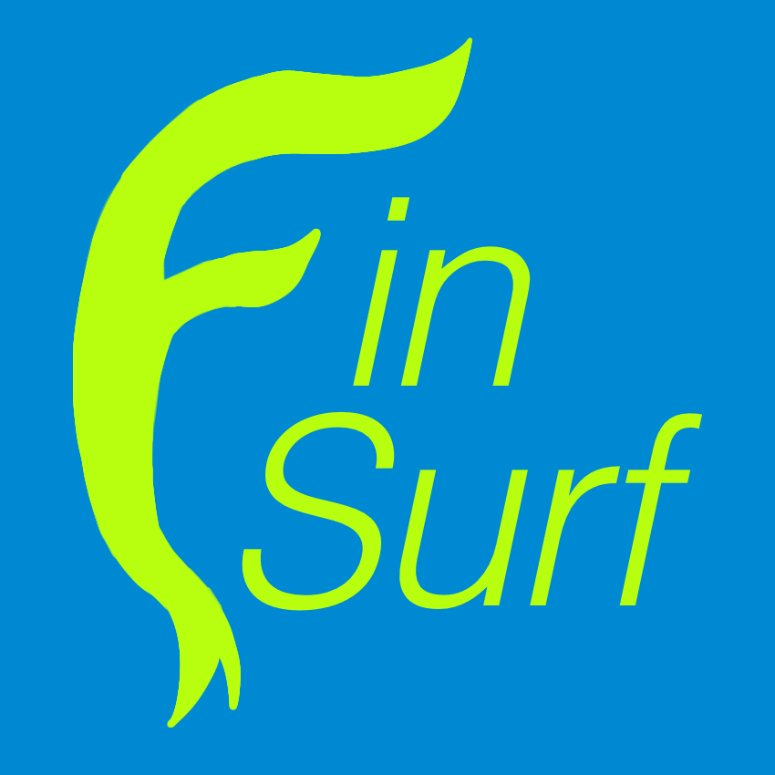
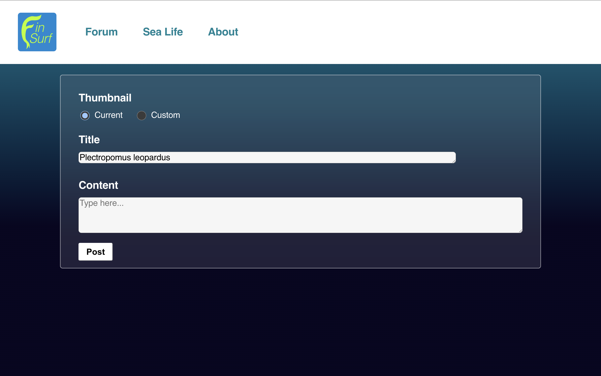
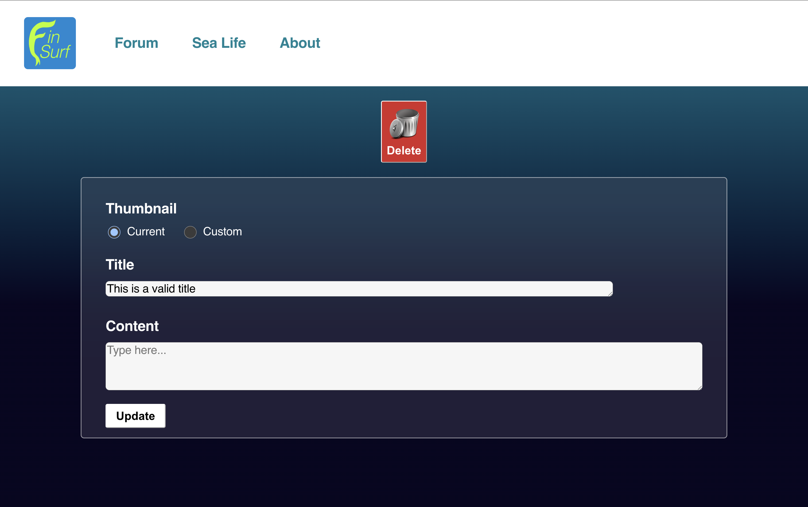
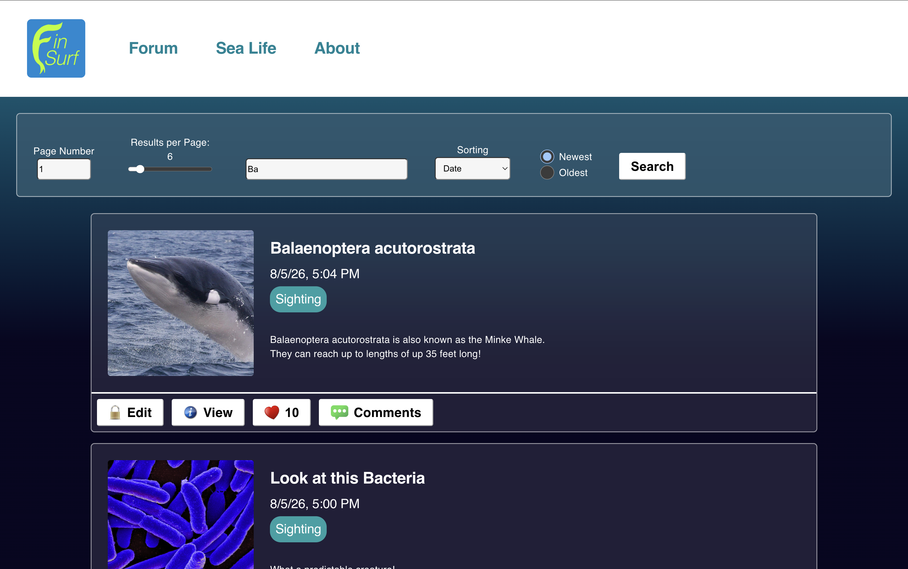
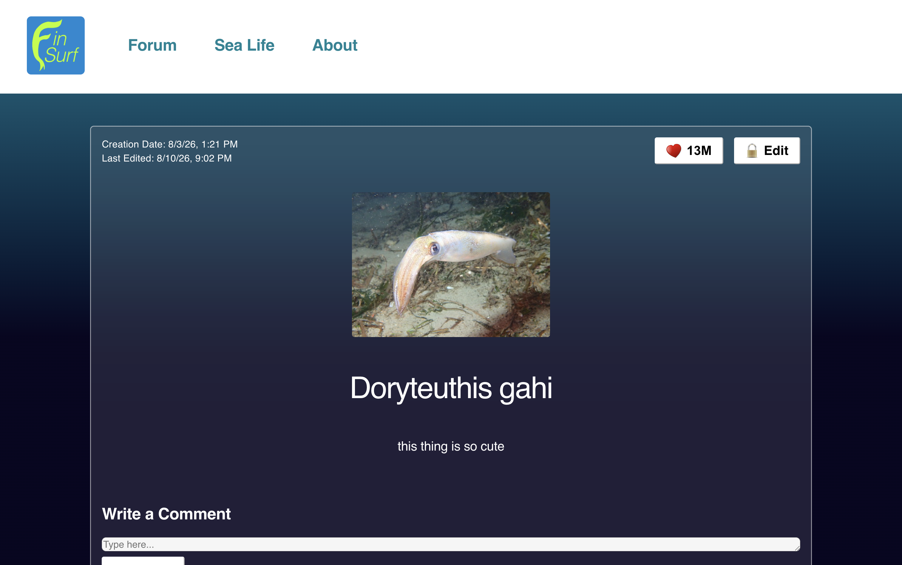
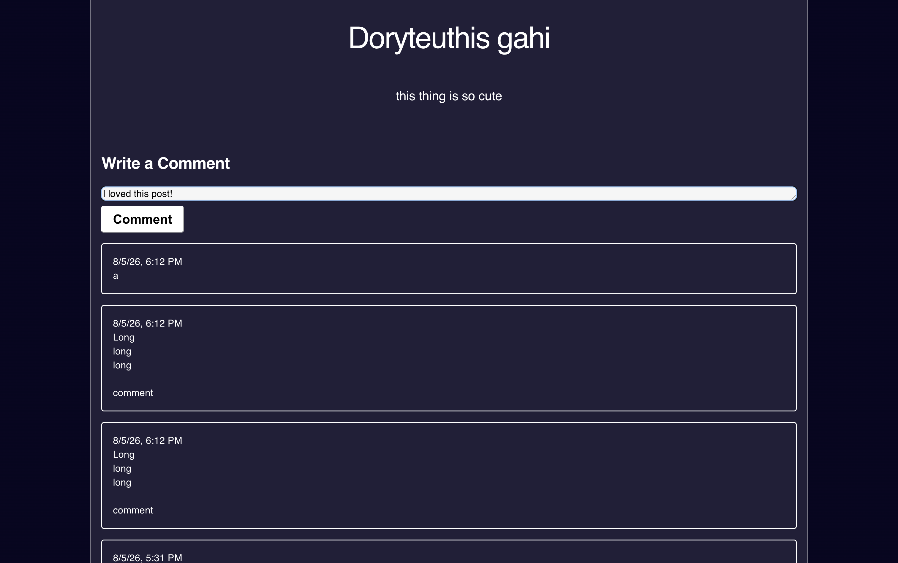
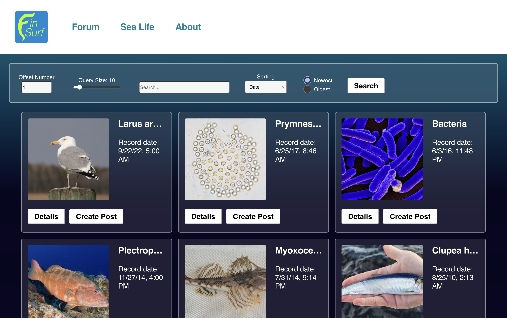
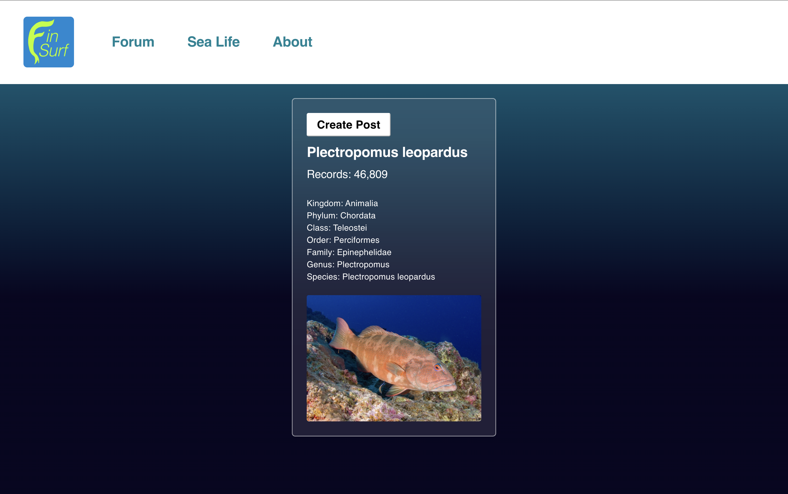

<!-- Improved compatibility of back to top link: See: https://github.com/othneildrew/Best-README-Template/pull/73 -->
<a id="readme-top"></a>

<!-- TABLE OF CONTENTS -->
<details>
  <summary>Table of Contents</summary>
  <ol>
    <li>
      <a href="#about-the-project">About The Project</a>
      <ul>
        <li><a href="#built-with">Built With</a></li>
        <li><a href="#features">Features</a></li>
      </ul>
    </li>
    <li>
      <a href="#getting-started">Getting Started</a>
      <ul>
        <li><a href="#prerequisites">Prerequisites</a></li>
        <li><a href="#installation">Installation</a></li>
      </ul>
    </li>
    <li><a href="#demo">Demo</a></li>
    <li><a href="#license">License</a></li>
    <li><a href="#contact">Contact</a></li>
    <li><a href="#acknowledgments">Acknowledgments</a></li>
  </ol>
</details>

https://finsurf.netlify.app/

<a href="https://finsurf.netlify.app/">
  
</a>


<!-- ABOUT THE PROJECT -->
## About The Project

Fin Surf is a forum where users can create, edit, delete, read, upvote, and comment on posts about marine life. Using the public REST API provided by the Ocean Biodiversity Information System (OBIS), this website allows visitors to browse through and sort millions of marine life occurrences. Visitors can see an organism's scientific name, record time, taxonomic hierarchy, and that creature's number of occurrences in the OBIS database.

### Built With

This application was programmed with Javascript, CSS, and HTML in a React framework.
* [![React][React.js]][React-url]

### Features

- **A create form that allows the user to create posts**
  - Form requires users to add a post title
  - If provided by the iNaturalist API, an organism image is automatically assigned
  - Optionally, users can:
    - Include additional textual content
    - Use a custom image added as an external image URL
  - Editing allows creatures to be deleted as well



- **A forum feed displaying previously created posts**
  - Each post on the posts feed shows the post's:
    - Image
    - Title
    - Creation time
    - Post category (multiple options to be implemented)
    - Edit button
    - View post button
    - Upvotes count and button
    - Comments button
- **Post Filtering**
  - Users can search by post title via an input box
  - Users can page through results via:
    - A range bar to specify how many posts they would like to see per page
    - Another input box to choose which page of results to view 
  - Choosing ascending or descending, users can sort posts by:
    - Creation time
    - Upvotes
- **Each created post has a separate post page when clicked**
  - Additional information is shown, including:
    - Creation time
    - Time of most recent edit, if applicable
    - Upvotes count and button
    - Edit button
    - Image
    - Title
    - Text Content
    - Comment Section
      - Reading posted comments
      - An input box to post new comments




- **A sea creature browser displaying records from the Ocean Biodiversity Information System API**
  - Each creature card shows the creature's:
    - Scientific name
    - Record time
    - View details button
    - Create post button
- **Each creature record has a separate page when clicked**
  - Additional information is shown, including:
    - Create post button
    - Record time
    - Scientific name
    - The number of total records of this organism in the database
    - The taxonomy tree, including:
      - Kingdom
      - Phylum
      - Class
      - Order
      - Family
      - Genus
      - Species
    - Creature image
- **Sea Life Filtering**
  - Users can search by creature name via an input box
  - Users can change query results via:
    - A range bar to specify how many creatures they would like to be included in the query
    - Another input box to choose an offset of the query results
      - For example: if a user chooses a query size of twenty and an offset number of three, the query will skip the first forty records and return the records from forty-one through sixty
  - Choosing ascending or descending, users can sort posts by:
    - Record time



<p align="right">(<a href="#readme-top">back to top</a>)</p>


<!-- GETTING STARTED -->
## Getting Started

To get a local copy up and running, follow these simple example steps.

### Prerequisites

Please update your npm tool.
* npm
  ```sh
  npm install npm@latest -g
  ```

### Installation

1. Clone the repo
   ```sh
   git clone https://github.com/andrebayucan/fin-surf
   ```
2. Install NPM packages
   ```sh
   npm install
   ```
3. Change git remote url to avoid accidental pushes to base project
   ```sh
   git remote set-url origin https://github.com/github_username/repo_name.git
   git remote -v # confirm the changes
   ```

<p align="right">(<a href="#readme-top">back to top</a>)</p>


<!-- DEMO EXAMPLES -->
## Demo

### Forum posts and filtering

https://github.com/user-attachments/assets/4e1b9adc-83c2-4da7-9db6-3f2a0c796d76

### View a post page

https://github.com/user-attachments/assets/08f0a251-60ee-4459-8383-d44839a09dd5

### Sea life and filtering

https://github.com/user-attachments/assets/16f603ba-97c1-42a7-9ecf-6534d8aff7fb

### Sea life sorting

https://github.com/user-attachments/assets/a3dfcaa8-135b-47a4-9a65-6df88905fdac

### Post creation

https://github.com/user-attachments/assets/65c9a171-631c-460b-86d6-85b31ee0d1d7

<p align="right">(<a href="#readme-top">back to top</a>)</p>


<!-- License -->
## License

    Copyright [2026] [Andre Bayucan]

    Licensed under the Apache License, Version 2.0 (the "License");
    you may not use this file except in compliance with the License.
    You may obtain a copy of the License at

        http://www.apache.org/licenses/LICENSE-2.0

    Unless required by applicable law or agreed to in writing, software
    distributed under the License is distributed on an "AS IS" BASIS,
    WITHOUT WARRANTIES OR CONDITIONS OF ANY KIND, either express or implied.
    See the License for the specific language governing permissions and
    limitations under the License.

<!-- CONTACT -->
## Contact

Andre Bayucan - [LinkedIn](https://www.linkedin.com/in/andrebayucan) - andrebayucan@gmail.com

Project Link: https://github.com/andrebayucan/fin-surf

<p align="right">(<a href="#readme-top">back to top</a>)</p>


<!-- ACKNOWLEDGMENTS -->
## Acknowledgments

This project was the final website I created for CodePath's WEB102: Intermediate Web Development course. I used the public REST APIs provided by the first two organizations below, linking their main websites.

* [Ocean Biodiversity Information System](https://obis.org/)
* [iNaturalist](https://www.inaturalist.org/)
* [Supabase](https://supabase.com/)
* [Netlify](https://www.netlify.com/)
* [CodePath](https://www.codepath.org/)

<p align="right">(<a href="#readme-top">back to top</a>)</p>


<!-- MARKDOWN LINKS & IMAGES -->
[React.js]: https://img.shields.io/badge/React-20232A?style=for-the-badge&logo=react&logoColor=61DAFB
[React-url]: https://reactjs.org/
